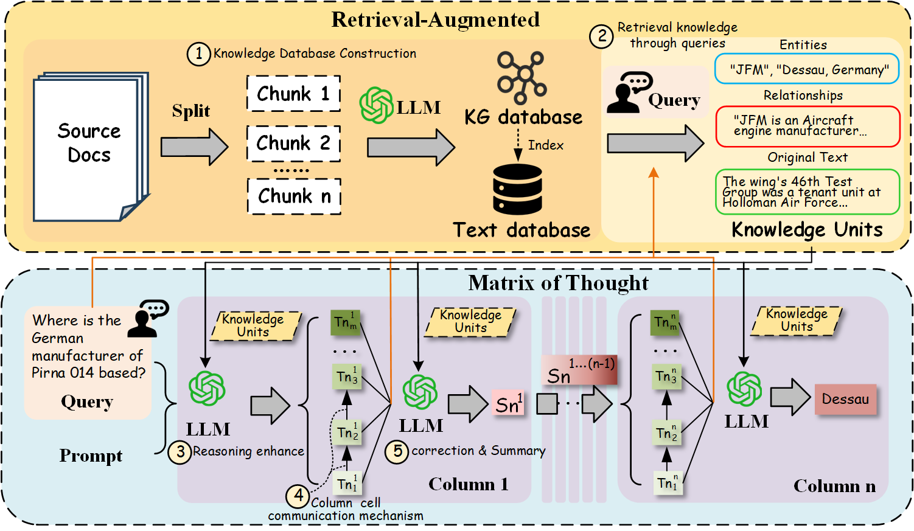

# MTQA: Matrix of Thought for Enhanced Reasoning in Complex Question Answering

## Abstract ##

Complex Question Answering (QA) is a fundamental and challenging task in NLP. While large language models (LLMs) exhibit impressive performance in QA, they suffer from significant performance degradation when facing complex and abstract QA tasks due to insufficient reasoning capabilities. Works such as Chain-of-Thought (CoT) and Tree-of-Thought (ToT) aim to enhance LLMs' reasoning abilities, but they face issues such as in-layer redundancy in tree structures and single paths in chain structures. Although some studies utilize Retrieval-Augmented Generation (RAG) methods to assist LLMs in reasoning, the challenge of effectively utilizing large amounts of information involving multiple entities and hops remains critical. To address this, we propose the Matrix of Thought (MoT), a novel and efficient LLM thought structure. MoT explores the problem in both horizontal and vertical dimensions through the "column-cell communication" mechanism, enabling LLMs to actively engage in multi-strategy and deep-level thinking, reducing redundancy within the column cells and enhancing reasoning capabilities. Furthermore, we develop a fact-correction mechanism by constructing knowledge units from retrieved knowledge graph triples and raw text to enhance the initial knowledge for LLM reasoning and correct erroneous answers. This leads to the development of an efficient and accurate QA framework (MTQA). Experimental results show that our framework outperforms state-of-the-art methods on four widely-used datasets in terms of F1 and EM scores, with reasoning time only 14.4\% of the baseline methods, demonstrating both its efficiency and accuracy. 

** Here is an overview of the MTQA framework: **

## Paper and Repository ##

This repository hosts the code implementation for the MTQA framework, which we are currently finalizing for submission. Once the paper is accepted, we will officially release the full code and documentation to the public, enabling researchers and practitioners to utilize and build upon this work.

## Code Release ##

Our code will be made publicly available after the paper is accepted for publication. We aim to provide clear documentation and examples to ensure ease of use for the research community.

## License ##

The code will be released under [appropriate license] upon publication.

## Citation ##

If you use this code in your research, please cite the following paper:

MTQA: Matrix-of-Thought Question Answering Framework
